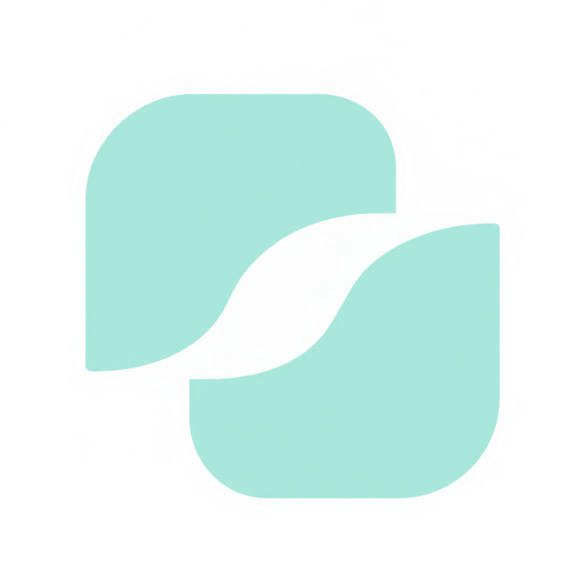

# Anotherface · UNITEC

<a id="readme-top"></a>

<!-- PROJECT SHIELDS -->
[![Contributors][contributors-shield]][contributors-url]
[![Forks][forks-shield]][forks-url]
[![Stargazers][stars-shield]][stars-url]
[![Issues][issues-shield]][issues-url]
[![MIT License][license-shield]][license-url]

<!-- PROJECT LOGO -->
<br />
<div align="center">
  <a href="https://github.com/usuario/unitec_face_swap">
    
  </a>

  <h3 align="center">AnotherFace UNITEC</h3>

  <p align="center">
    Demo educativa UNITEC — filtros IA con cámara y registro en Supabase.
    <br />
    <a href="https://github.com/usuario/unitec_face_swap"><strong>Explora los documentos »</strong></a>
    <br />
    <br />
    <a href="https://github.com/usuario/unitec_face_swap">Ver Demo</a>
    ·
    <a href="https://github.com/usuario/unitec_face_swap/issues">Reportar Bug</a>
    ·
    <a href="https://github.com/usuario/unitec_face_swap/issues">Solicitar Característica</a>
  </p>
</div>

<!-- TABLE OF CONTENTS -->
<details>
  <summary>Tabla de Contenidos</summary>
  <ol>
    <li>
      <a href="#sobre-el-proyecto">Sobre el Proyecto</a>
      <ul>
        <li><a href="#características">Características</a></li>
        <li><a href="#construido-con">Construido Con</a></li>
      </ul>
    </li>
    <li>
      <a href="#comenzando">Comenzando</a>
      <ul>
        <li><a href="#prerrequisitos">Prerrequisitos</a></li>
        <li><a href="#instalación">Instalación</a></li>
      </ul>
    </li>
    <li><a href="#uso">Uso</a></li>
    <li><a href="#estructura-del-proyecto">Estructura del Proyecto</a></li>
    <li><a href="#roadmap">Roadmap</a></li>
    <li><a href="#licencia">Licencia</a></li>
  </ol>
</details>

<!-- ABOUT THE PROJECT -->
## Sobre el Proyecto

[![Captura de Pantalla del Producto][product-screenshot]](https://github.com/usuario/unitec_face_swap)

AnotherFace es una aplicación web interactiva desarrollada para demostraciones educativas en UNITEC. Permite a los usuarios aplicar filtros faciales en tiempo real (malla, deformar, remolino, perrito) utilizando la cámara de su dispositivo. El procesamiento (landmarks faciales, deformaciones, etc.) se realiza directamente en el frontend usando tecnología web estándar, mientras que un backend en Node.js administra de manera segura la subida de capturas y la recolección de metadatos de sesión (con protección de Row Level Security en Supabase) para análisis avanzado posterior.

### Características
* Detección facial en tiempo real usando MediaPipe Face Mesh.
* Aplicación de filtros interactivos dinámicos: Original, Malla facial, Perrito, Deformar y Remolino animado.
* Deformaciones basadas en topología geométrica y triangulación facial interna en 2D.
* Interfaz web *responsive* (Dark Mode) con panel lateral de control de cámara.
* Captura de foto temporal (hasta 4 horas de disponibilidad) y almacenamiento seguro a través de backend Node.js.
* Recolección y registro de metadatos (puntos nodales y configuración de sesión) en Supabase (PostgreSQL).
* Dashboard administrador básico incorporado en el entorno local.

### Construido Con

* [![Node][Node.js]][Node-url]
* [![Express][Express.js]][Express-url]
* [![Supabase][Supabase]][Supabase-url]
* [![MediaPipe][MediaPipe]][MediaPipe-url]

<p align="right">(<a href="#readme-top">volver arriba</a>)</p>

<!-- GETTING STARTED -->
## Comenzando

Para obtener una copia local funcionando, sigue estos sencillos pasos.

### Prerrequisitos

* Node.js 18.x o superior.
* NPM (o gestor de dependencias de tu preferencia).
* Cuenta de Supabase configurada con su respectivo proyecto de base de datos.

### Instalación

1. Clona el repositorio
   ```sh
   git clone https://github.com/usuario/unitec_face_swap.git
   ```
2. Instala los paquetes de NPM
   ```sh
   cd unitec_face_swap
   npm install
   ```
3. Configura tus variables de entorno renombrando `.env.example` a `.env`
   ```env
   SUPABASE_URL=tu_url_de_supabase
   SUPABASE_KEY=tu_service_role_key
   ADMIN_PASSWORD=tu_contraseña_para_dashboard
   ```

<p align="right">(<a href="#readme-top">volver arriba</a>)</p>

<!-- USAGE EXAMPLES -->
## Uso

Para iniciar el servidor de desarrollo local:

```sh
npm run start
# o
npm run dev
```

El servidor se iniciará en `http://localhost:3000`. Puedes acceder al panel de administrador en `http://localhost:3000/admin.html` usando la contraseña configurada en el archivo `.env`.

<p align="right">(<a href="#readme-top">volver arriba</a>)</p>

## Estructura del Proyecto

```text
unitec_face_swap/
├── public/                 # Archivos estáticos del Frontend
│   ├── assets/             # Imágenes y recursos gráficos
│   ├── index.html          # Interfaz principal de la aplicación web
│   ├── app.js              # Lógica del frontend (Detección y Filtros en Canvas)
│   ├── styles.css          # Estilos e interfaz oscura
│   ├── admin.html          # Interfaz del panel de administrador
│   └── admin.js            # Lógica del panel
├── scripts/                # Scripts de automatización y construcción
├── supabase/               # Archivos de configuración de base de datos
│   └── schema.sql          # Esquema de Supabase y políticas RLS
├── server.js               # Servidor backend Express (Node.js)
├── package.json            # Dependencias del proyecto
├── render.yaml              # Configuración de despliegue
└── README.md               # Documentación del proyecto
```

<p align="right">(<a href="#readme-top">volver arriba</a>)</p>

<!-- ROADMAP -->
## Roadmap

- [ ] Optimización de rendimiento para dispositivos móviles de gama baja.
- [ ] Implementación de nuevos filtros estáticos (Face Swap).
- [ ] Mejorar la calibración y seguimiento facial frente a giros extremos.

Consulta los [issues abiertos](https://github.com/usuario/unitec_face_swap/issues) para ver una lista completa de las características propuestas (y problemas conocidos).

<p align="right">(<a href="#readme-top">volver arriba</a>)</p>

<!-- LICENSE -->
## Licencia

Distribuido bajo la Licencia MIT.

<p align="right">(<a href="#readme-top">volver arriba</a>)</p>

<!-- MARKDOWN LINKS & IMAGES -->
<!-- https://www.markdownguide.org/basic-syntax/#reference-style-links -->
[contributors-shield]: https://img.shields.io/github/contributors/usuario/unitec_face_swap.svg?style=for-the-badge
[contributors-url]: https://github.com/usuario/unitec_face_swap/graphs/contributors
[forks-shield]: https://img.shields.io/github/forks/usuario/unitec_face_swap.svg?style=for-the-badge
[forks-url]: https://github.com/usuario/unitec_face_swap/network/members
[stars-shield]: https://img.shields.io/github/stars/usuario/unitec_face_swap.svg?style=for-the-badge
[stars-url]: https://github.com/usuario/unitec_face_swap/stargazers
[issues-shield]: https://img.shields.io/github/issues/usuario/unitec_face_swap.svg?style=for-the-badge
[issues-url]: https://github.com/usuario/unitec_face_swap/issues
[license-shield]: https://img.shields.io/github/license/usuario/unitec_face_swap.svg?style=for-the-badge
[license-url]: https://github.com/usuario/unitec_face_swap/blob/main/LICENSE
[product-screenshot]: https://via.placeholder.com/800x400.png?text=AnotherFace+Screenshot
[Node.js]: https://img.shields.io/badge/node.js-6DA55F?style=for-the-badge&logo=node.js&logoColor=white
[Node-url]: https://nodejs.org/
[Express.js]: https://img.shields.io/badge/express.js-%23404d59.svg?style=for-the-badge&logo=express&logoColor=%2361DAFB
[Express-url]: https://expressjs.com/
[Supabase]: https://img.shields.io/badge/Supabase-3ECF8E?style=for-the-badge&logo=supabase&logoColor=white
[Supabase-url]: https://supabase.com/
[MediaPipe]: https://img.shields.io/badge/MediaPipe-00A859?style=for-the-badge&logo=mediapipe&logoColor=white
[MediaPipe-url]: https://developers.google.com/mediapipe


